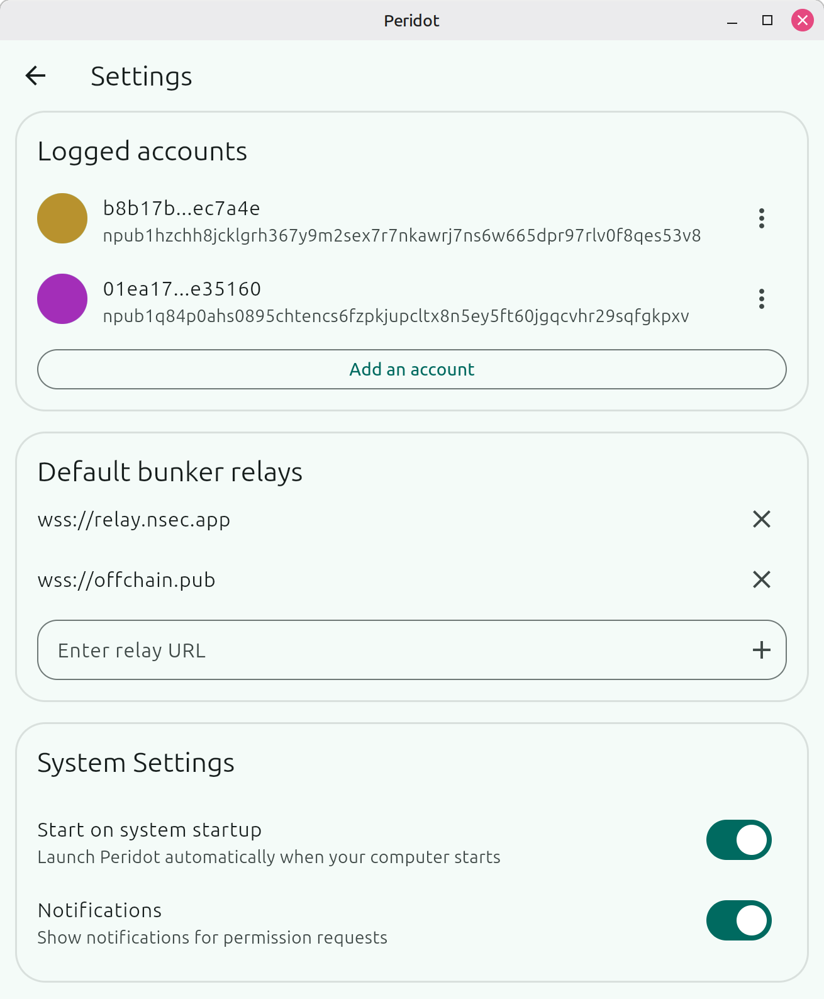
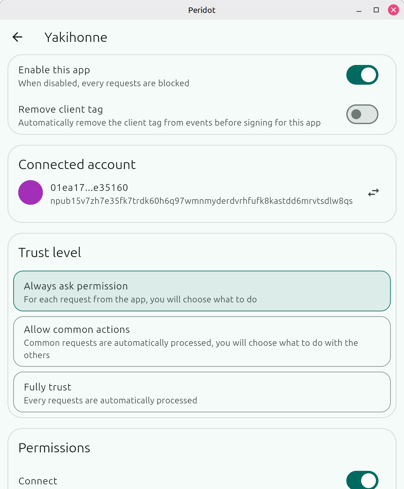
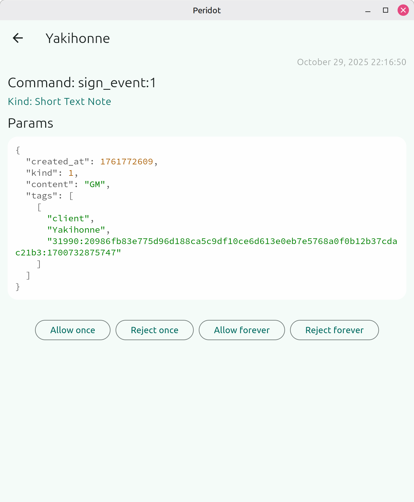

# Peridot

Nostr bunker for desktop. Protect your Nostr identity, verify requests before the apps get it.

## Usage

Download the latest version from [releases](https://github.com/nogringo/peridot/releases) or use the [web app](https://nogringo.github.io/peridot/).

### macOS

**Note:** The app is not code-signed. To open it:
1. Right-click the app and select "Open" (instead of double-clicking)
2. Click "Open" in the warning dialog

Or after trying to open:
1. Go to System Settings > Privacy & Security
2. Find "Peridot was blocked" and click "Open Anyway"

## Screenshots

